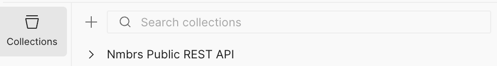
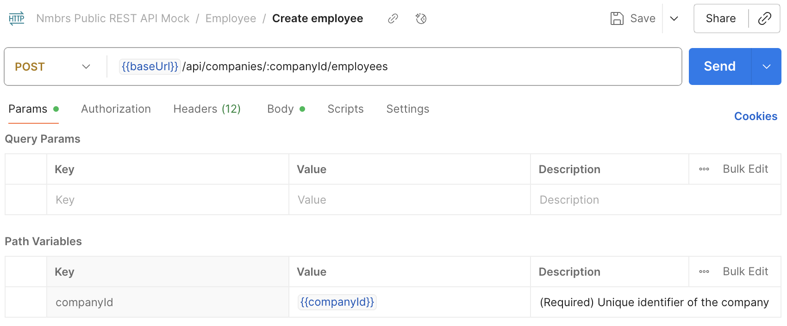

The steps described on this page show you how to use the Nmbrs API to integrate your HRIS with Nmbrs for employee management actions. 

We will walk you through how to create and update employees using curl and Postman using a real-life scenario. 

## Requirements

Before you start, make sure you:

- Have an account for both:
    - [Nmbrs](https://developer.nmbrs.com/docs/create-nmbrs-account), and
    - The [Nmbrs Developer Portal](https://developer.nmbrs.com/signin)
- Are logged into both accounts
- Are [subscribed to a product](https://developer.nmbrs.com/products) and have a corresponding subscription key
- Have [created a valid integration app](https://partner-portal.nmbrs.com/integrations) in the Nmbrs Partner Portal 
- Have [authenticated to the Nmbrs REST API](https://nmbrs.stoplight.io/docs/nmbrs-restapi/e9e0f5292b4a1-authentication) and have a corresponding access token
- (Optional) Have [forked the Nmbrs API collection](https://nmbrs.stoplight.io/docs/nmbrs-restapi/9c14f1c024642-getting-started#how-to-fork-a-collection) if using Postman
- (Optional) Have set up your [environment variables locally](https://www.freecodecamp.org/news/how-to-set-an-environment-variable-in-linux/) or [created an environment on Postman](https://learning.postman.com/docs/sending-requests/variables/environment-variables/)

## How to create an employee

To give context to the steps described below, we will simulate a common use-case for creating and updating an employee.

Let's say John Doe is applying for a job at the Negocio company. He submits his CV to Negocio and a profile is created in the company's HRIS. 

If Negocio's HRIS is integrated to Nmbrs, a corresponding profile is automatically created in Nmbrs. It contains minimal information about the candidate, such as name, last name, and email. 

You can test the Create Employee call to better understand how this API works.

1. Replace the example parameter values in the request below with John's details. 

    !!! tip "Extensive list of parameters"
        
        In this example we include only the required parameters. Refer to the [Nmbrs API Reference](https://nmbrs.stoplight.io/docs/nmbrs-restapi/13c6a8d9c7190-create-employee#request-body) for an extensive list of all the parameters you can include in your payload.

    ```bash
      '{
        "PersonalInfo": {
            "basicInfo": {
              "firstName": "John",
              "lastName": "Doe",
              "employeeType": "applicant"
              },
            "period": {
              "year": 2021,
              "period": 4
              },
            "contactInfo": {
              "businessEmail": "doe@business.com"
              }
          }
      }'
    ```

    | Parameter | Description                      | 
    | ------------------- | --------------------------------- | 
    | `PersonalInfo`   | Object that groups all information about the employee. Refer to the [Nmbrs API Reference](https://nmbrs.stoplight.io/docs/nmbrs-restapi/13c6a8d9c7190-create-employee#request-body) for an extensive list of all employee information parameters you can include in your payload.  | 
    | `basicInfo`    | Object that groups parameters referring to the employee's basic information    | 
    | `firstName`    | **REQUIRED** Employee's first name    |
    | `lastName`    | **REQUIRED** Employee's last name    |
    | `employeeType`     | **REQUIRED**  Type of employee. Allowed values include: `applicant`, `newHire`, `payroll`, `formerPayroll`, `external`, `formerExternal` and `rejectedApplicant`  |
    | `period` | Object that groups parameters referring to the employee's time in the company |
    | `year` | Year |
    | `period` (child) | Period |
    | `contactInfo` | Object that groups parameters referring to the employee's contact information |
    | `businessEmail` | Employee's business email address |

2. Send the request.

    !!! note

        If you have not configured your environment variables make sure you replace the required path and query parameters placeholders with your corresponding values.

    === "Using cURL"

        Open a terminal on your machine and run the following command.

        ```bash
        curl --request POST \
        --url https://api.nmbrsapp.com/api/companies/{companyId}/employees \
        --header 'Accept: application/json' \
        --header 'Authorization: Bearer 123' \
        --header 'Content-Type: application/json' \
        --header 'X-Subscription-Key: ' \
        --data '{
          "PersonalInfo": {
            "basicInfo": {
              "firstName": "John",
              "lastName": "Doe",
              "employeeType": "applicant"
            },
            "period": {
              "year": 2021,
              "period": 4
            },
            "contactInfo": {
              "businessEmail": "doe@business.com"
            }
          }
        }'
        ```

    === "Using Postman"
        1. Go to the **Collections** tab.
        
        2. Expand the **Nmbrs Public REST API** dropdown.
        3. Expand the **Employees** folder and click on the **Create employee** endpoint. The endpoint overview appears.
        
        4. Review the **Param** tab to ensure your path and query parameters are correctly filled out.
        5. Enter the request body you completed in the previous step in the **Body** tab. 
        6. Click **Send**.


    In both cases, you should get a response like the following:

    ```json
    {
      "employeeId": "d30ec597-bd29-453e-9613-7786297eedcc"
    }
    ```

    !!! tip "Document the employee ID"
        When integrating your HRIS with Nmbrs, we recommend you keep a mapping table of the data you sync. You can store the `employeeId` in your HRIS/Nmbrs mapping table, as you will need it for future updates.

    !!! info "Error messages"
        If you get an error message instead, refer to the [Responses reference](https://nmbrs.stoplight.io/docs/nmbrs-restapi/13c6a8d9c7190-create-employee#responses) of the **Create employee** endpoint.


## How to update an employee's personal information

Once John is hired, more information is asked of him. The HR representative has to update his profile accordingly. They include John's birth date, his personal email and phone. 

To test this action:

1. Create a request payload that includes the personal information you want to update for John, and the required parameters. 

    !!! warning "Make sure you review all parameters"
        PUT-type requests replace the resource you are updating with the new request payload. This means that if you want to keep most of your original configuration and only update one or more parameters, you must ensure that the body includes all parameters and values you want to preserve. You can use the [GET an employee](https://nmbrs.stoplight.io/docs/nmbrs-restapi/eea078fe0d752-get-an-employee) endpoint to retrieve the complete data object of an employee. 

    !!! tip "Extensive list of parameters"
        
        Refer to the [Nmbrs API Reference](https://nmbrs.stoplight.io/docs/nmbrs-restapi/13c6a8d9c7190-create-employee#request-body) for an extensive list of all the parameters you can include in your payload.

    ```bash
    '{
      "PersonalInfo": {
          "basicInfo": {
            "firstName": "John",
            "lastName": "Doe",
            "employeeType": "applicant"
            },
          "birthInfo": {
            "birthDate": "2019-08-24T14:15:22Z"
            },
          "period": {
            "year": 2021,
            "period": 4
            },
          "contactInfo": {
            "privateEmail": "doe@private.com",
            "businessEmail": "doe@business.com",
            "privatePhone": "+351222222"
            }
        }
    }'
    ```

2. Send the request.

    === "Using cURL"

        Open a terminal on your machine and run the following command. Replace `{employeeId}` in the path with the John's employee ID, created in the previous step.

        ```bash
        curl --request PUT \
          --url https://api.nmbrsapp.com/api/employees/{employeeId}/personalInfo \
          --header 'Accept: application/json' \
          --header 'Authorization: Bearer 123' \
          --header 'Content-Type: application/json' \
          --header 'X-Subscription-Key: ' \
          --data '{
            "PersonalInfo": {
                "basicInfo": {
                  "firstName": "John",
                  "lastName": "Doe",
                  "employeeType": "applicant"
                  },
                "birthInfo": {
                  "birthDate": "2019-08-24T14:15:22Z"
                  },
                "period": {
                  "year": 2021,
                  "period": 4
                  },
                "contactInfo": {
                  "privateEmail": "doe@private.com",
                  "businessEmail": "doe@business.com",
                  "privatePhone": "+351222222"
                  }
              }
          }'
        ```

    === "Using Postman"

        1. Go to the **Collections** tab.
        
        2. Expand the **Nmbrs Public REST API** dropdown.
        3. Expand the **Employees** folder and click on the **Create employee** endpoint. The endpoint overview appears.
        
        4. Go to the **Param** tab and enter the ID you documented in the previous step as a value for the `{employeeId}`.
        5. Go to the **Body** tab and replace the contents of the existing body with the one you defined in the previous step. 
        6. Click **Send**.

    In both cases, you should get a response like the following:

    ```json
    {
      "personalInfoId": "756bd0de-fc2f-4b7c-b7ba-d3a3f5360a5b"
    }
    ```

    !!! info "Error messages"
        If you get an error message instead, refer to the [Responses reference](https://nmbrs.stoplight.io/docs/nmbrs-restapi/e12e45d11695c-update-employee-personal-info#responses) of the **Update employee personal info** endpoint.